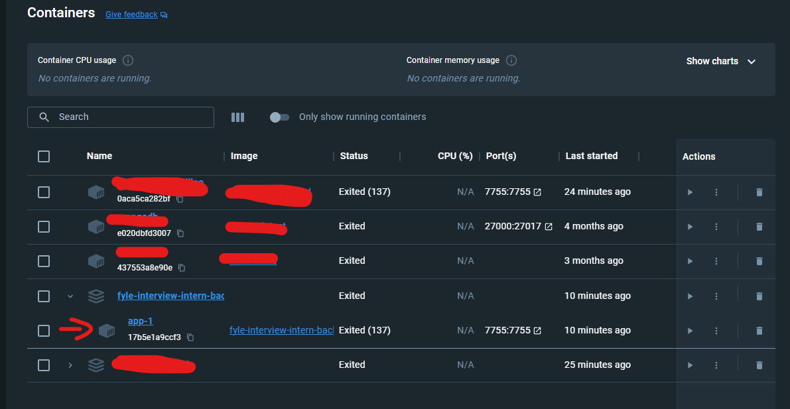
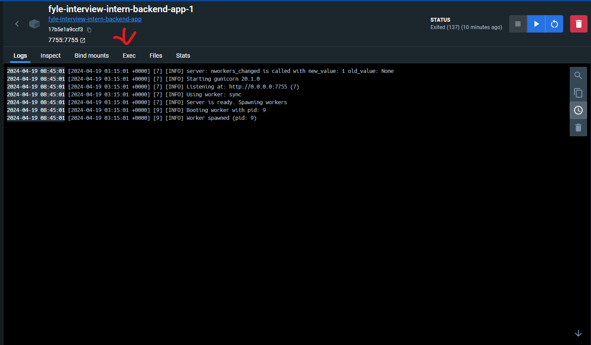
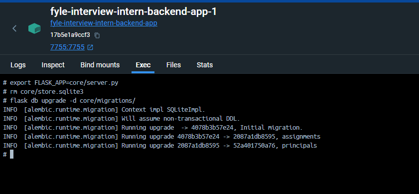
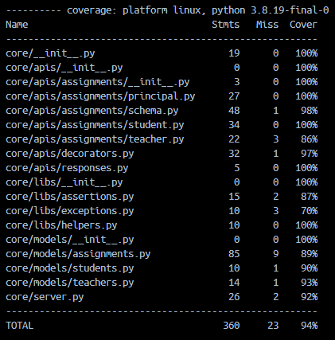

# Fyle Backend Challenge

## Challenge outline
- [x] Add missing APIs mentioned here and get the automated tests to pass
- [x] Add tests for grading API
- [x] Please be aware that intentional bugs have been incorporated into the application, leading to test failures. Kindly address and rectify these issues as part of the assignment.
- [x] All tests should pass
Get the test coverage to 94% or above
- [x] There are certain SQL tests present inside tests/SQL/. You have to write SQL in following files:
- count_grade_A_assignments_by_teacher_with_max_grading.sql
- number_of_graded_assignments_for_each_student.sql
- [x] Optionally, Dockerize your application by creating a Dockerfile and a docker-compose.yml file, providing clear documentation on building and running the application with Docker, to stand out in your submission

# How to Run this app using docker?

1) 

```
docker compose up
```
2. Get into the container shell -




3. Reset DB

```
export FLASK_APP=core/server.py

# its fine if this causes an error, continue on
rm core/store.sqlite3

flask db upgrade -d core/migrations/
```


4. Finally execute either 

`pytest -vvv -s tests/` - to see if all tests pass

or

`pytest --cov` - to see test coverage

WARNING: reset db everytime after you run tests.

# Test coverage report



### Reset DB

```
export FLASK_APP=core/server.py
rm core/store.sqlite3
flask db upgrade -d core/migrations/
```

### Run Tests

```
pytest -vvv -s tests/

# for test coverage report
# pytest --cov
# open htmlcov/index.html
```
